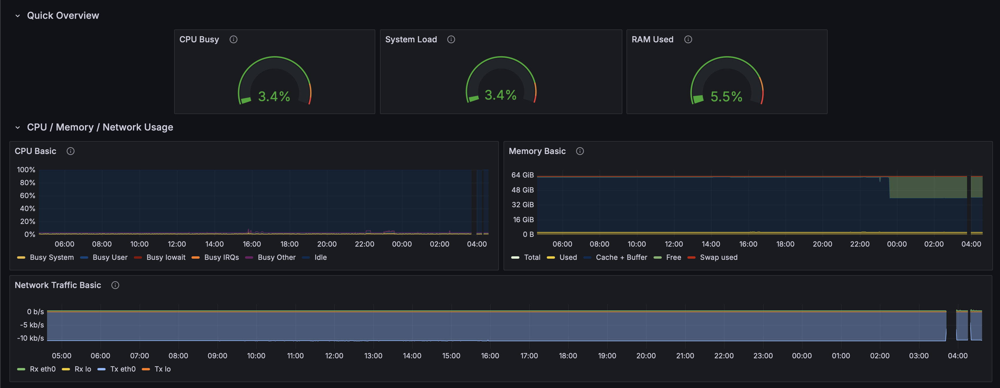

This repository contains the documentation for my personal homelab environment. This setup serves as a practical learning tool for systems administration, networking, and containerization, running 24/7.

---

### 🛠️ Hardware Infrastructure

| Component         | Model/Details                                       | Role                                           |
| ----------------- | --------------------------------------------------- | ---------------------------------------------- |
| **Primary Server** | HPE ProLiant DL380P Gen8                            | Main host for all containerized services.      |
| **CPU** | 2x Intel Xeon E5-2650 @ 2.00GHz (16 Cores / 32 Threads) | Powers all virtual machines and containers.    |
| **RAM** | 64GB ECC RAM                                        | Provides memory for all running applications.  |
| **Network Switch** | Netgear GS108tv3 Managed Switch                     | Manages network traffic and VLANs for the lab. |
| **Power Workstation** | Alienware M15 (i7-9750H, 32GB, RTX 2060)            | Primary Windows client and testing machine.    |

---

### 📦 Software & Services

My entire software stack is managed via Docker and Docker Compose for easy deployment, scaling, and maintenance.

* **Host OS:** **Ubuntu Server** on the HPE ProLiant.
* **Containerization:** **Docker & Docker Compose**.
* **Key Services:**
    * **Odoo:** Used for helpdesk ticketing and project management (migrated from Nextcloud).
    * **RustDesk:** Self-hosted server for secure remote access to lab machines.
    * **Samba:** Provides a centralized NAS file share, mounted as a network drive on Windows and MacOS clients for high-performance storage (e.g., Steam library).
    * **Grafana & Prometheus:** Powers the live status monitoring panel.
    * **Nginx Proxy Manager:** Manages reverse proxy and SSL certificates for all web services.
    * **Pi-Hole:** Provides network-wide ad blocking and local DNS resolution (Split-Brain DNS)
* **Troubleshooting Case Studies:**
    * **Case Study:**<a href="#" style="text-decoration: none"> Solving a Complex DNS Resolution Issue in a Homelab Environment</a>

---

### 📊 Homelab Monitoring Dashboard

> This is a snapshot of my custom Grafana dashboard, which I use to monitor my homelab server's health and performance in real-time. It visualizes key metrics for CPU, memory, storage, and network activity collected via Telegraf and stored in an InfluxDB database.

> A fully interactive version of this dashboard will be hosted on my upcoming portfolio site.

    

---

### 🌐 Network Diagram

*(This is optional but highly recommended. You can use a free tool like `diagrams.net`, create a simple diagram, save it as a PNG, upload it to this repository, and then link to it here.)*

``
